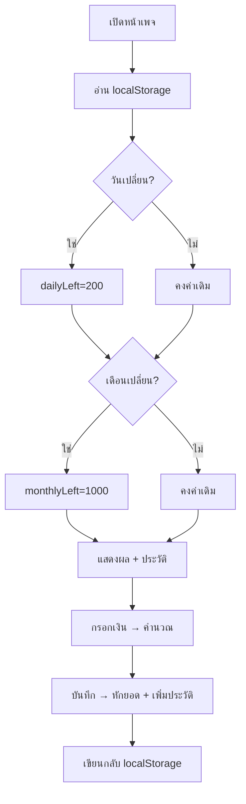

# ไทยช่วยไทย พลัส (Thai Helps Thai Plus)

Landing Page แบบ mobile-first บน GitHub Pages ใช้ Vanilla HTML/CSS/JS (ไม่มี build step, ไม่มี login) จดจำข้อมูลผู้ใช้ด้วย `localStorage`

## โครงสร้างไฟล์
- `index.html` — โครงหน้าเพจทั้งหมด (การ์ดหลัก + การ์ดประวัติ + footer)
- `css/styles.css` — สไตล์ mobile-first โทนส้ม-น้ำเงิน-แดง (ตามโลโก้/ตัวอย่าง)
- `js/app.js` — ตรรกะคำนวณ 60/40, นาฬิกาเดิน, จัดการ localStorage, render ประวัติ
- `assets/logo.png` — คัดลอกจาก `data-reference/logo.png`
- `README.md` — อัปเดตวิธีใช้งาน + วิธี deploy
- `.nojekyll` — ไฟล์ว่าง กัน GitHub Pages ประมวลผลแบบ Jekyll

## ส่วนของหน้าเพจ (บนลงล่าง ตาม sample plate)
1. โลโก้ `assets/logo.png`
2. หัวข้อ "ไทยช่วยไทย พลัส"
3. คำอธิบาย "ลดภาระ ลดค่าครองชีพ"
4. แถบวันที่ไทย + นาฬิกาเดินจริง: เช่น `วันจันทร์ที่ 1 มิถุนายน 2569  •  20:10:45` (พ.ศ. = ค.ศ.+543, เวลา hh:mm:ss แบบ 24 ชม. อัปเดตทุก 1 วินาทีด้วย `setInterval`)
5. กล่องสถิติ 2 ช่อง: `วันนี้เหลือ X/200` และ `เดือนนี้เหลือ Y/1000`
6. ช่องกรอก "จำนวนเงินที่ต้องการซื้อ" (input ตัวเลข, หน่วยบาท)
7. ปุ่ม "คำนวณ" (ส้มทึบ) และ "บันทึก" (เส้นขอบ)
8. ผลคำนวณ list-down: `รัฐช่วย` / `คุณจ่าย` (โผล่หลังกดคำนวณ ตาม Calculate.png)
9. การ์ด "ประวัติการใช้จ่าย" + ปุ่ม "ล้างทั้งหมด" + ตาราง (วันที่:เวลา, ยอดซื้อ, รัฐช่วย, คุณจ่าย) + ปุ่มลบรายรายการ (ตาม save.png)
10. Footer "พัฒนาโดย นายโซเฟียน สะลาแม"

## ตรรกะการคำนวณ 60/40 (พร้อมเพดาน)
ให้ `P` = จำนวนเงินที่กรอก, `dailyLeft` = เหลือวันนี้, `monthlyLeft` = เหลือเดือนนี้
- `govIdeal = 0.6 * P`
- `gov = min(govIdeal, dailyLeft, monthlyLeft)`  ← รัฐช่วยถูกจำกัดด้วยเพดานที่เหลือ
- `userPay = P - gov`  ← คุณจ่ายส่วนที่เหลือทั้งหมด

ตัวอย่างตรวจสอบ (จาก README): `P=300` → `gov=180`, `userPay=120`, วันนี้เหลือ `200-180=20`, เดือนนี้เหลือ `1000-180=820` ✓

- "คำนวณ" = แสดงผลอย่างเดียว (ยังไม่หักยอด)
- "บันทึก" = หักยอด `dailyLeft -= gov`, `monthlyLeft -= gov`, เพิ่มรายการประวัติ, แล้วเซฟลง localStorage
- กันกรอกค่าว่าง/ติดลบ/ศูนย์ และปัดทศนิยม 2 ตำแหน่งในการแสดงผล

## การจดจำข้อมูล (localStorage) + รีเซ็ตตามวัน/เดือน
เก็บ object เดียวใน key เช่น `thpp_state`:

```json
{
  "dailyLeft": 200,
  "monthlyLeft": 1000,
  "lastDate": "2026-06-01",
  "lastMonth": "2026-06",
  "history": [
    { "ts": "2026-06-01T18:54:00", "amount": 300, "gov": 180, "userPay": 120 }
  ]
}
```

ตอนโหลดหน้า:
- ถ้า `lastDate` ไม่ตรงวันนี้ → รีเซ็ต `dailyLeft = 200` และอัปเดต `lastDate`
- ถ้า `lastMonth` ไม่ตรงเดือนนี้ → รีเซ็ต `monthlyLeft = 1000` และอัปเดต `lastMonth` (วงเงินไม่ทบข้ามเดือน ตาม README)
- โหลดประวัติมาแสดงเหมือนเดิม → ตอบโจทย์ "ปิดเว็บแล้วกลับมายังจำได้"



## แนวทางจดจำผู้ใช้แบบไม่ต้อง login (ตอบคำถาม)
บน static host อย่าง GitHub Pages นักพัฒนานิยมใช้:
- localStorage (เลือกใช้): จำต่อเบราว์เซอร์/เครื่อง ง่ายสุด ไม่ต้องมี server เหมาะกับงานนี้ — ข้อจำกัด: ผูกกับเครื่อง/เบราว์เซอร์ และหายถ้าล้าง cache
- IndexedDB: สำหรับข้อมูลโครงสร้างใหญ่ (เกินความจำเป็นของงานนี้)
- Cookies: เก่ากว่า เหมาะส่งไป server ซึ่งงานนี้ไม่มี
- Backend-as-a-Service (Firebase/Supabase) + anonymous ID: ใช้เมื่อต้อง sync ข้ามเครื่อง (อนาคตต่อยอดได้)

## Deploy ขึ้น GitHub Pages
- วาง `index.html` ที่ root ของ repo
- push ขึ้น GitHub → Settings > Pages > Source = `main` / root
- ได้ URL รูปแบบ `https://<username>.github.io/ThaiHelpsThaiPlus/`
- หมายเหตุ: path รูป/ไฟล์ใช้แบบ relative (`assets/...`, `css/...`, `js/...`) เพื่อให้ทำงานใต้ subpath ของ Pages ได้

## หมายเหตุ/สิ่งที่จะตัดสินใจเอง (แจ้งให้ทราบ)
- ใช้ฟอนต์ไทยจาก Google Fonts (เช่น Prompt/Sarabun) ผ่าน CDN
- โทนสีอิงตัวอย่าง: ส้ม `#f57c00` เป็นสีหลัก, แดง/น้ำเงินจากโลโก้
- รูปแบบเวลาใช้ 24 ชม. (`hh = 0-23`) ตามที่ระบุ